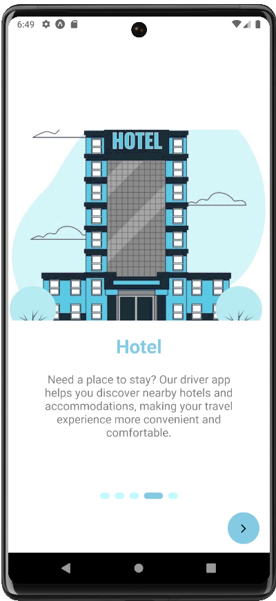
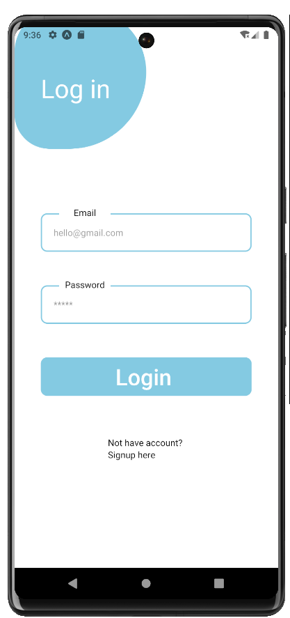
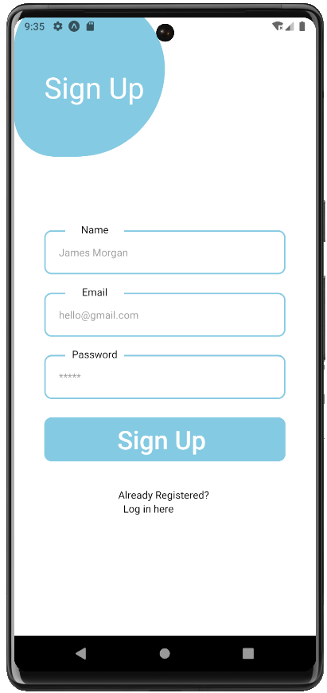
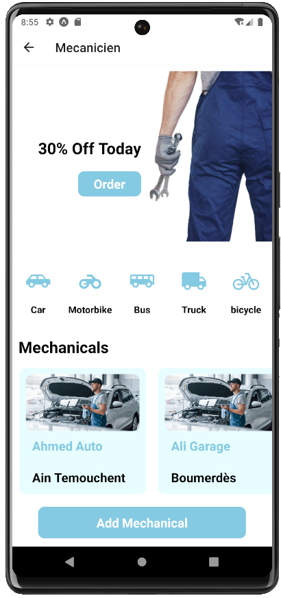
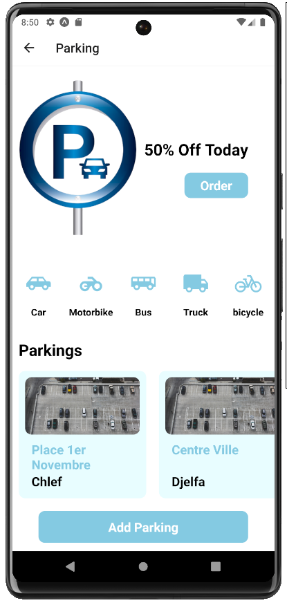
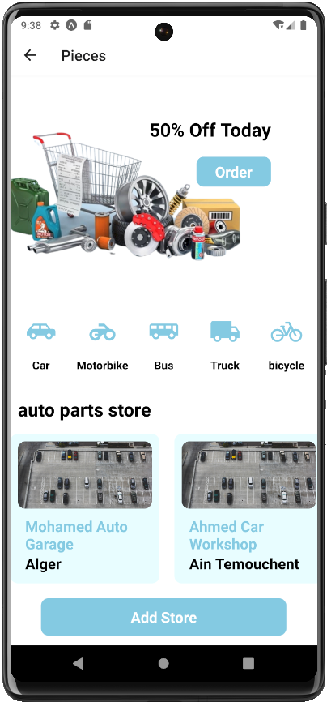
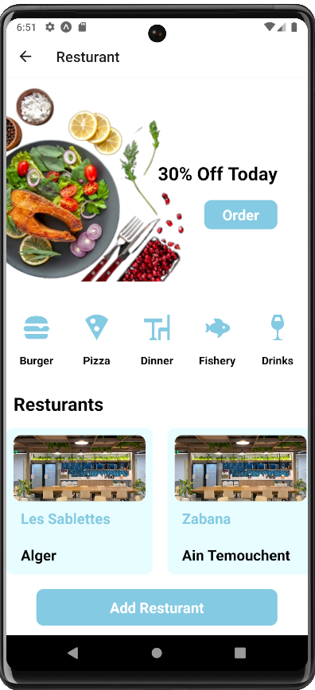
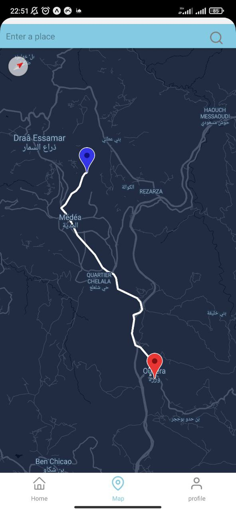

# DRIVER-apk
 ### Onboarding Screens: 

  
  
  
  
  
  

 ### LogIn & SignUp: 

  
  

 ### Services Screens: 

 ### Navigation Map: 

<h3 align="left">Languages and Tools:</h3>

  
  
  
 
 

